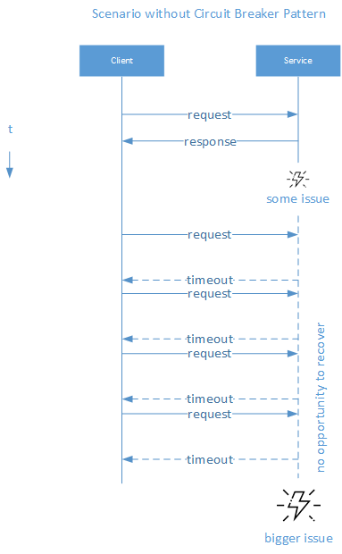
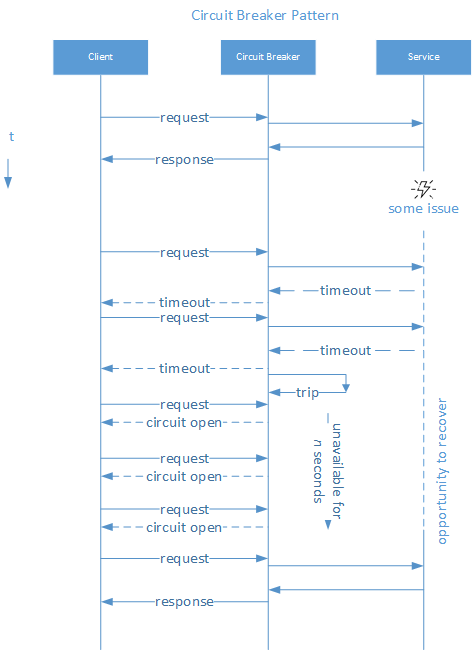
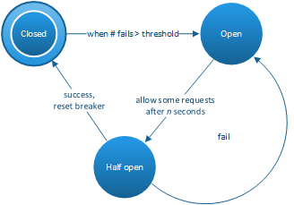

# Single Node Pattern: Circuit Breaker Pattern #
## Deploying a Circuit Breaking ambassador with NGINX Ingress and Kubernetes on AKS ##

In this lab we'll guide you through the steps to deploy a Circuit Breaker pattern as an ambassador.


## Introduction into the Circuit Breaker Pattern

A key tenet of modern application design is that failure will occur. You need to assume that one or more parts of your application will fail in some manner at some point. The **Circuit Breaker** pattern can help you prevent, mitigate and manage failures by:
- allowing failing services to recover, before sending them requests again
- re-routing traffic to alternative data sources
- rate limiting
 
To illustrate this, consider the following turn of events:



Without a **Circuit Breaker**, the **Client** will keep trying to send a request to the **Service**, event after something went wrong and the **Service** isn't able to respond in time. Because the **Client** keeps retrying, possibly with many other clients simultaneously, the **Service** will have no opportunity to recover, if the issue at hand is only transient of nature.

Now, consider the following turn of events:



With a Circuit Breaker, the **Client** will no longer be able to overload the **Service** with requests after the **Circuit Breaker** was "tripped" after the second timeout. The **Circuit Breaker** will avoid sending the **Service** any new requests for the next n seconds. This allows the **Service** to recover. Once a certain time has passed, the **Circuit Breaker** will slowly start passing on requests to the **Service** again until it is fully regained strength, as illustrated in the following State Diagram:



## Best Practices

When using a Circuit Breaker there are a few best practices to follow:
- Make sure to put each request in a different thread from a thread pool, and implement them as future or promise. This way when the thread pool is exhausted you can trigger the circuit breaker.
- Have different thresholds for different type of errors. A timeout problem may have more retries available then let's say a connection problem. 

Please check out these pages if you want to read more about the Circuit Breaker Pattern:
- [Circuit Breaker - Martin Fowler](https://martinfowler.com/bliki/CircuitBreaker.html "Circuit Breaker - by Martin Fowler")
- [NGINX Circuit Breaker Pattern](https://www.nginx.com/blog/microservices-reference-architecture-nginx-circuit-breaker-pattern/ "NGINX Circuit Breaker Pattern")

## Prerequisites

In order to run the samples in this lab,you will need the following:

- An active [Microsoft Azure](https://azure.microsoft.com/en-us/free "Microsoft Azure") Subscription
- [Azure CLI](https://docs.microsoft.com/en-us/cli/azure/overview?view=azure-cli-latest "Azure CLI") installed
- [Curl](https://curl.haxx.se/download.html "Curl") command line tool installed (for downloading ```kubectl``` as well as testing samples in this lab)
- [Kubernetes CLI (kubectl)](https://kubernetes.io/docs/tasks/tools/install-kubectl/ "Kubernetes CLI (kubectl)") installed
- A new **Resource Group** and **Container Service (AKS)** created in the [Microsoft Azure Portal](https://portal.azure.com "Microsoft Azure Portal") to run samples in.
- Open a Command Prompt window (with an active PATH environment variable pointing to Azure CLI and Kubernetes CLI)

- Although not required, we encourage you to read the book *Designing Distributed Systems* by Brendan Burns.  The samples in this lab are written with the reader of this book in mind: [https://azure.microsoft.com/en-us/resources/designing-distributed-systems/en-us/](https://azure.microsoft.com/en-us/resources/designing-distributed-systems/en-us/ "Designing Distributed Systems")


## 1. First time set up ##

If you have never used Azure CLI or Kubernetes CLI before or have used it but for a different subscription, you need to link your Azure subscription to the local Kubernetes configuration.

### 1.1 **Kubernetes CLI Local Configuration**

If you are using the Kubernetes CLI on a windows machine, it expects a ```config``` file in this folder location:

````html
%USERPROFILE%\.kube
````

For instance, if your user name is TestUser, you may find the kubectl ```config``` file in ```C:\Users\TestUser\.kube```

**Optionally:** If your Kubernetes configuration file is located elsewhere, in order for the Kubernetes CLI (kubectl) to find your configuration, you need to add the above path (including the 'config' file name) to the ```KUBECONFIG``` environment variable in a Command Prompt window, as such:

    SET KUBECONFIG=c:\pathtokubeconfig\config

 
### 1.2 **Logging into Azure from the Command Line**

In order for the ```kubectl``` statements below to be fired against the correct Azure Kubernetes (AKS) instance, you must link your Azure subscription to the local Kubernetes configuration.

First you need to sign in, by entering the following command in a Command Prompt window:


    az login

This will result in the following output:

    To sign in, use a web browser to open the page https://aka.ms/devicelogin and enter the code B9R2CY8ZP to authenticate.
    
Now, you need to open a browser and go to ```https://aka.ms/devicelogin``` and type in the code returned from the ```az login``` command: ```B9R2CY8ZP```


This will authenticate your device to Azure and a response similar to this should appear in your Command Prompt window:

    [
      {
	    "cloudName": "AzureCloud",
	    "id": "3b7912c3-ad06-426e-8627-419123727111",
	    "isDefault": true,
	    "name": "CanvizDev",
	    "state": "Enabled",
	    "tenantId": "3dad2b09-9e66-4eb8-9bef-9f44544b0222",
	    "user": {
	      "name": "testuser@canviz.com",
	      "type": "user"
	    }
      }
    ]
    
### 1.3 **Linking your Azure subscription**

Next, you need to link your Azure subscription so that the Azure CLI (```az```) will work against your environment.

    az account set --subscription "3b7912c3-ad06-426e-8627-419123727111" 

### 1.4 **Getting Kubernetes configuration from Azure**

If you haven't already created a Resource Group for this lab, you can do so now with the following command:

    az group create --name circuitbreaker --location "eastus"

And if you haven't already create an AKS cluster, you can do so now with the following command:

	az aks create --name circuitbreaker --resource-group circuitbreaker --location "eastus" –-node-count 1 --generate-ssh-keys

> **Note:** This process may take a few minutes to complete.

Then, to make sure you can use **Azure Container Service (AKS)** as our context for when running ```kubectl``` commands, you need to enter the following command:

    az aks get-credentials --resource-group circuitbreaker --name circuitbreaker

where ```circuitbreaker``` is the name of a **Resource Group** you have created for yourself in the Azure Portal and ```circuitbreaker``` is the name of the **Managed Container Service** (AKS, not ACS!) you created in the Azure Portal. 

If successful, this will result in the following output:

    Merged "circuitbreaker" as current context in C:\Users\TestUser\.kube\config

**Optionally: Set the context, if you have used other Kubernetes clusters before**

If you have been developing against a local or a different Kubernetes cluster, your current ```kubectl``` configuration may point to a different cluster. To correct this, please use the following command:

    kubectl config set-context circuitbreaker

### 1.5 **Verify the correct Kubernetes cluster**

Use the following command to verify you are talking to the correct Kubernetes cluster:

    kubectl cluster-info

The output of this command should look similar to this:

    Kubernetes master is running at https://circuitbreaker-77a9ac84.hcp.eastus.azmk8s.io:443
    Heapster is running at https://circuitbreaker-77a9ac84.hcp.eastus.azmk8s.io:443/api/v1/namespaces/kube-system/services/heapster/proxy
    KubeDNS is running at https://circuitbreaker-77a9ac84.hcp.eastus.azmk8s.io:443/api/v1/namespaces/kube-system/services/kube-dns:dns/proxy
    kubernetes-dashboard is running at https://circuitbreaker-77a9ac84.hcp.eastus.azmk8s.io:443/api/v1/namespaces/kube-system/services/kubernetes-dashboard/proxy
    
If the URLs in the output point to localhost, use the ```kubectl config set-context``` command to change the context to the correct cluster.


### 1.6 **Create a Container Registry**

In order for you to storage private Docker container images later on in this lab, you will need to create a Azure Container Registry in your Azure account first.

But to group all the examples in this lab together, you will be creating a Resource Group for this lab first (f you haven't already done so) called ```circuitbreaker```:

    az group create --name circuitbreaker --location "eastus"

Then you will create the actual Azure Container Registry, which we will call ```circuitbreaker``:

    az acr create --name circuitbreakerregistry --sku Basic --location eastus --admin-enabled --resource-group circuitbreaker

This will result in an output similar to this:

    {
      "adminUserEnabled": true,
      "creationDate": "2018-03-02T19:55:15.184411+00:00",
      "id": "/subscriptions/3b7912c3-ad06-426e-8627-419123721111/resourceGroups/circuitbreaker/providers/Microsoft.ContainerRegistry/registries/circuitbreakerregistry",
      "location": "eastus",
      "loginServer": "circuitbreakerregistry.azurecr.io",
      "name": "circuitbreakerregistry",
      "provisioningState": "Succeeded",
      "resourceGroup": "circuitbreaker",
      "sku": {
    "name": "Basic",
    "tier": "Basic"
      },
      "status": null,
      "storageAccount": null,
      "tags": {},
      "type": "Microsoft.ContainerRegistry/registries"
    }

> **Note:** You will need to take note of your Azure subscription ID above (3b7912c3-ad06-426e-8627-419123721111), you will need that in the following command:

Next, you will need to assign your Azure user as owner to the newly created Azure Container Registry:

    az ad sp create-for-rbac --scopes /subscriptions/paste_your_subscription_id_here/resourceGroups/circuitbreaker/providers/Microsoft.ContainerRegistry/registries/circuitbreakerregistry --role Owner --password Test12345

So, for instance:

    az ad sp create-for-rbac --scopes /subscriptions/3b7912c3-ad06-426e-8627-419123721111/resourceGroups/circuitbreaker/providers/Microsoft.ContainerRegistry/registriescircuitbreakerregistry --role Owner --password Test12345

That will result in an output similar to this:

    Retrying role assignment creation: 1/36
    {
      "appId": "c1d73d5d-7f01-4e4d-b621-32ebe014ebb5",
      "displayName": "azure-cli-2018-03-02-19-55-29",
      "name": "http://azure-cli-2018-03-02-19-55-29",
      "password": "Test12345",
      "tenant": "3dad2b09-9e66-4eb8-9bef-9f44544b0e74"
    }

> **Note:** Please take note of the values for **appId** and **password** above, you will need those in the next step, when you will be creating a 
> 
>  in Kubernetes and log in into Docker to link the two together. 

### 1.7. **Create in a Secret in Kubernetes**

Now you will create a Secret in Kubernetes that will allow you to start using your own private Docker images in AKS:

    kubectl create secret docker-registry circuitbreakerregistry.azurecr.io --docker-server=circuitbreakerregistry.azurecr.io --docker-username=c1d73d5d-7f01-4e4d-b621-32ebe014ebb5 --docker-password=Test12345 --docker-email=youremailaddress@yourdomain.com 

Please make sure you replace the parameter values for **docker-username**, **docker-password** with the **appId** and **password** from the previous command and replace **docker-email** with your Docker e-mail, before running the command above.

### 1.8. **Login into Docker**

Finally, you will need to log in to Docker, so you can start building and pushing your own Docker images:

    docker login circuitbreakerregistry.azurecr.io

It will ask you for your a user name and password. Please use the **appId** from the previous command as user name and the **password** from the previous command as the password. So, for instance: 

    Username: c1d73d5d-7f01-4e4d-b621-32ebe014ebb5
    Password: Test12345

## 2. Deploying the Dummy Service into Azure Container Services (AKS)

Now you have created your own Docker registry in Azure Container Registry, you can now push Docker images to this registry.

In the ```DummyServiceContainer``` folder you will find the NodeJS implementation of a container that will serve as our service which we need to protect from overloading, by implementing a circuit breaker ambassador in front of it.

To properly test this ```DummyServiceContainer``` we *need it to fail* so that it will trigger the Circuit Breaker. To make that happen, we added a ```/fakeerrormode``` endpoint. Once called the container will start faking timeout issues by just not sending a response within the timeout limit. 

Consider the ```server.js```:
    
    // This is a little NodeJS server that mimicks a production service that we want to protect with a Circuit Breaker. 
    // To prove the Circuit Breaker works and stops overloading this service with calls when it is in a transient failure so it can recover, we need to fake this service to become unreachable.
    // In order to mimick this service to become unreachable for clients, we'll expose an endpoint that you can call so that this service starts behaving like it is crashed.
    // We'll fake this crash by calling a non-blocking setTimeout() statement on incoming requests, when we are in this "fake error" mode.
    // We will also expose an endpoint to get this service out of the "fake error" mode so that triggers the Circuit Breaker to go in half-open state, before returning to fully closed state (=fully working state)
    'use strict';
    
    const express = require('express');
    
    var ready = false;
    console.log('Container is not yet ready.');
    
    const PORT = 80;
    const HOST = '0.0.0.0';
    const app = express();
    
    // We will be using this boolean to mimick an issue with this service
    var fakeAnError = false;
    
    app.get('/alive', (req, res) => {
    
    // In order for Kubernetes not to kill and restart our container in this test scenario, we always have to return /alive OK 
    // Otherwise we can't show the NGINX Circuit Breaker at work in detail (as Kubernetes would automatically take care of issues and restart a container if it would become unavailable)
    // In production scenarios 
    //if (!fakeAnError) {
    res.status(200).send('OK');
    //} else {
    
    // Have a non-blocking delay in the response of this endpoint that waits more than the request/read timeout configured in the NGINX configuration
      //  setTimeout(() => {
    //res.status(503).send('ERROR');
    //}, 30000)
    
    //}
    
    });
    
    app.get('/ready', (req, res) => {
    
    // If we are in error mode, wait a while before sending back a result... just like if we had a real issue in the container...
    if (fakeAnError) {
    setTimeout(() => {
    // Since this is in the time out callback, this may cause an error if res is already released
    res.status(503).send('BUSY');
    }, 30000)
    } else
    if (!ready) {
    res.status(503).send('BUSY');
    } else {
    res.status(200).send('OK');
    }
    
    });
    //app.get('/healthz', (req, res) => {
    
    //if (!fakeAnError) {
    //res.status(200).send('OK');
    //} else {
    
    //// Have a non-blocking delay in the response of this endpoint that waits more than the request/read timeout configured in the NGINX configuration
    //setTimeout(() => {
    //res.status(503).send('ERROR');
    //}, 30000)
    
    //}
    
    //});
    app.get('/somerequest', (req, res) => {
    
    if (!fakeAnError) {
    res.status(200).send('SOMERESPONSE');
    } else {
    
    // Have a non-blocking delay in the response of this endpoint that waits more than the request/read timeout configured in the NGINX configuration
    setTimeout(() => {
    res.status(503).send('ERROR');
    }, 30000)
    
    }
    
    });
    app.get('/', (req, res) => {
    
    if (!fakeAnError) {
    res.status(200).send('SOMERESPONSE');
    } else {
    
    // Have a non-blocking delay in the response of this endpoint that waits more than the request/read timeout configured in the NGINX configuration
    setTimeout(() => {
    res.status(503).send('ERROR');
    }, 30000)
    
    }
    
    });
    
    // These 2 endpoints will toggle the "fakeerror" mode on/off for subsequent requests
    app.post('/fakeerrormodeon', (req, res) => {
    fakeAnError = true;
    res.status(200).send('OK');
    });
    app.post('/fakeerrormodeoff', (req, res) => {
    fakeAnError = false;
    res.status(200).send('OK');
    });
    
    app.listen(PORT, HOST);
    console.log(`Running on http://${HOST}:${PORT}`);
    
    ready = true;
    
      

As you can see from this source code, calling the service at the ```/fakeerrormodeon``` endpoint will set the boolean fakeAnError to true, which in turn will make all requests to the endpoint ```/``` delay for 30 seconds. Which should be enough to trigger the Circuit Breaker into thinking the service is unhealthy.

> *Note: * In the source code above you can also see an endpoint ```/alive``` which returns OK. Even, if the ```fakeAnError``` boolean is true. This is necessary, because otherwise Kubernetes (which is managing this container) will also think the container became unhealthy and will trigger a kill and re-create of the container to bring it back up. This will interfere with our demonstration of the Circuit Breaker doing its work. So, we'll have Kubernetes think the container is healthy, even when our Circuit Breaker thinks is not.

### 2.1. Build Docker Image for the DummyServiceContainer

Navigate to the ```DummyServiceContainer```  folder and execute the following command:

    docker build . -t circuitbreakerregistry.azurecr.io/dummyservice
   
### 2.2. Push Docker Image to Azure Container Registry

Then, execute the following command to push your Docker image to the Azure Container Registry:

    docker push circuitbreakerregistry.azurecr.io/dummyservice

### 2.3. Deploy DummyServiceContainer to Azure Container Services (AKS)

Consider the following ```dummy-deployment.yaml```:

    apiVersion: extensions/v1beta1
    kind: Deployment
    metadata:
      name: dummy-deployment
    spec:
      replicas: 1
      template:
        metadata:
          labels:
            app: dummy-deployment
        spec:
          containers:
          - name: dummy-depoyment
            image: mwittenbols/dummyservice
            ports:
            - containerPort: 80
            livenessProbe:
              httpGet:
                path: /alive
                port: 80
                scheme: HTTP
              initialDelaySeconds: 5
              timeoutSeconds: 10
          # In production scenarios restartPolicy should be set to "Always", but for now, since we want to demonstrate the behaviour of the Circuit Breaker pattern we   
          # want to avoid Kubernetes killing and automatically restarting our container.
          # This seems unsupported, although this could be an actual use case. Try it with a long termination grace period
          # restartPolicy: "Never"
          # Make it go slow on recreation of the container, so that we can properly test the Circuit Breaker
          # terminationGracePeriodSeconds: 1200

Notice the ```livenessProbe``` configuration, telling Kubernetes to check the container's health status by calling the ```/alive``` endpoint on our container every thing 10 seconds.

Deploy the ```DummyServiceContainer``` with the following command:

    kubectl create -f dummy-deployment.yaml

### 2.4. Expose the DummyServiceContainer

Expose the ```DummyServiceContainer``` to the outside world on port 80 by executing the following command:

    kubectl expose deployment dummy-deployment --port=80 --type=LoadBalancer --name dummy-deployment

### 2.5. Verify the DummyServiceContainer

Execute the following command to confirm that a pod is created for the ```DummyServiceContainer```:

    kubectl get pods --output=wide

This should result in an output like this:

    NAME                                READY     STATUS              RESTARTS   AGE         IP        NODE
    dummy-deployment-1077142786-cjk90   0/1       ContainerCreating   0          <invalid>   <none>    aks-nodepool1-11676488-0

While Kubernetes is issuing an IP address we can wait for the EXTERNAL IP address to be populated with the following command:

    kubectl get services --watch

Which should result in an output like this:

    NAME               TYPE           CLUSTER-IP     EXTERNAL-IP   PORT(S)        AGE
    dummy-deployment   LoadBalancer   10.0.134.219   <pending>     80:31172/TCP   <invalid>
    kubernetes         ClusterIP      10.0.0.1       <none>        443/TCP        12m

And after a few minutes:

    NAME               TYPE           CLUSTER-IP     EXTERNAL-IP      PORT(S)        AGE
    dummy-deployment   LoadBalancer   10.0.134.219   <pending>        80:31172/TCP   <invalid>
    kubernetes         ClusterIP      10.0.0.1       <none>           443/TCP        12m
    dummy-deployment   LoadBalancer   10.0.134.219   13.90.157.180    80:31172/TCP   2m

Once the EXTERNAL IP address is populated, you can use it to test the DummyServiceContainer with a cURL statement:

    curl http://13.90.157.180/alive

Which returns: 

    OK

Or:

    curl http://13.90.157.180/ready

Which returns: 

    OK

And if you would call the ```/``` endpoint:

    curl http://13.90.157.180/

It should return: 

    SOMERESPONSE

So, now you have verified the DummyServiceContainer is working as expected.

### 2.6. Have the DummyServiceContainer cause timeouts

Now, let's see if we can have the ```DummyServiceContainer``` "fake" a problem. Execute the following cURL command to have the ```DummyServiceContainer``` start causing timeouts:

    curl -d "" -s -D - http://13.90.157.180/fakeerrormodeon  

Which returns: 

    OK

Now, if you would call the same ```/``` endpoint as before, you will see the request will take a long time and respond with ```BUSY```

    curl http://13.90.157.180/

After a minute:

    BUSY

The same will happen for the ```/ready``` endpoint which we will implement to tell the Circuit Breaker that the ```DummyServiceContainer``` is experiencing an issue.

    curl http://13.90.157.180/

After a minute:

    BUSY

As you can see, when you execute the following command

    curl http://13.90.157.180/alive

It will still immediately return: 

    OK

Which is what you want, as we do not want to trigger Kubernetes into killing and re-creating the container.

With this, we are ready to start deploying the Circuit Breaker.

## 3. Deploying the Circuit Breaker with NGINX Plus and Kubernetes in Azure Container Services (AKS)

NGINX Plus has a robust active health‑check system with many options for checking and responding to health issues.

### 3.1. Passive Health Checking vs. Active Health Checking

For passive health checks, NGINX and NGINX Plus monitor transactions **as they happen**, and try to resume failed connections. If the transaction still cannot be resumed, NGINX and NGINX Plus mark the server as unavailable and temporarily stop sending requests to it until it is marked active again.

The circuit breaker pattern can **prevent failure before it happens** by reducing traffic to an unhealthy service or routing requests away from it. This requires an active health check connected to an introspective health monitor on each service. Unfortunately, a passive health‑check does not do the trick, as it only checks for failure – at which point, it is already too late to take preventative action. It is for this reason that the open source NGINX software (OSS) cannot implement the circuit breaker pattern – it only supports passive health checks.

NGINX Plus can periodically check the health of upstream servers by sending special health‑check requests to each server and verifying the correct response.

You can read more about the Circuit Breaker Patter in NGINX Plus here: https://www.nginx.com/blog/microservices-reference-architecture-nginx-circuit-breaker-pattern/

### 3.2. Configuring NGINX Plus for Circuit Breaking

Consider the following ```nginx-circuitbreaker.conf``` NGINX configuration file in the ```conf.d``` folder:

    # In case of any errors try the next upstream server before returning an error
    proxy_next_upstream  error timeout invalid_header http_502 http_503 http_504;
    
    upstream backend {
    	least_conn;
    
    	# PASSIVE HEALTH CHECKS
    	# 
    	# For passive health checks, NGINX and NGINX Plus monitor transactions as they happen, and try to resume failed connections. If the transaction still cannot be resumed, NGINX and NGINX 
    	# Plus mark the server as unavailable and temporarily stop sending requests to it until it is marked active again.
    
    	server dummy-deployment:80; // max_fails=1 fail_timeout=5s; # slow_start=30s;
    # server dummy-deployment:80 max_fails=2 fail_timeout=30s slow_start=30s;
    	# server dummy-deployment:80 max_fails=2 fail_timeout=30s slow_start=30s;
    }
    
    server {
    
    	# listen 443;
    	listen 80;
    	
    	# Note: The Nginx image we are including at this point, doesn't support Nginx Plus features listed below
    # location /health-check {
     #internal;
     #health_check uri=/health match=conditions fails=1 interval=3s;
    	 #	 proxy_pass http://backend;
     #}
    
    	 # These are the conditions the /health requests to the service must match in order for it to be deemed healthy
    	 # https://docs.nginx.com/nginx/admin-guide/load-balancer/http-health-check/
    	 match conditions {
     status 200-399;
     body ~ 'OK';
     }
    
    	 location / {
    	 	 proxy_pass http://backend;
    		 add_header Content-Type text/plain;
    		 # Retry Pattern
    		 # health_check interval=10 fails=3 passes=2;
    
     # ACTIVE HEALTH CHECKS
     # 
     # NGINX Plus can periodically check the health of upstream servers by sending special health‑check requests to each server and verifying the correct response.
     #
     # The "uri" parameter is the endpoint on the "dummyservice" server that will be used to determine health of the server. 
     # The "match" parameter is the conditions the response of /alive has to match in order for it to be deemed healthy
     # The "fails" parameter is the number after how many failed attempts the server is deemed to be unhealthy
     # The "intervals" parameter indicates the delay between calls to /alive to check the server's health
     # The "passes" parameter is the number of successful calls to /alive are needed to mark the server as healthy again.
    		 health_check uri=/ready match=conditions fails=1 interval=10s passes=10;
    	 }
    
    	 location /healthz {
     access_log off;
     return 200;
     }
    
    }
    
#### 3.2.1. health_check
Notice the ```health_check``` block. This custom NGINX configuration will tell NGINX Plus to actively check the health of the ```DummyServiceContainer``` (exposed as http://dummy-deployment) at the ```/ready``` endpoint (not to confuse with the ```/active``` end-point which was for Kubernetes to avoid killing the ```DummyServiceContainer``` while we test the Circuit Breaker pattern).

#### 3.2.2. match conditions
Then, take a look at the ```match conditions``` block in the ```nginx-circuitbreaker.conf``` above. That will tell NGINX Plus that for the DummyServiceContainer to be considered healthy, it needs to match the conditions mentioned. ```DummyServiceContainer``` is considered healthy, when:
- The HTTP response status code is between 200 and 339, and
- The response body is "OK"

### 3.3. Create a ConfigMap object for nginx-circuitbreaker.conf

In order for Kubernetes to be able to use the custom NGINX configuration file ```nginx-circuitbreaker.conf``` when firing up the NGINX Plus image, you need to create a ConfigMap object of it, after navigating to the root folder of this lab:

    kubectl create configmap circuitbreaker-conf --from-file=conf.d

### 3.4. Deploying the Circuit Breaker Deployment

Consider the file ```circuitbreaker-deployment.yaml```:
    
    #apiVersion: apps/v1beta1 # for versions before 1.9.0 use apps/v1beta2
    apiVersion: extensions/v1beta1
    kind: Deployment
    metadata:
      name: circuitbreaker-deployment
    spec:
      replicas: 1
      selector:
    matchLabels:
      app: nginx-ingress
      template: # create pods using pod definition in this template
    metadata:
      labels:
    app: nginx-ingress
      annotations:
    prometheus.io/port: '10254'
    prometheus.io/scrape: 'true'
    spec:
      containers:
    #  - image: nginxdemos/nginx-ingress
      - image: quay.io/kubernetes-ingress-controller/nginx-ingress-controller:0.9.0-beta.17
    imagePullPolicy: Always
    name: nginx-ingress-controller
    ports:
    - containerPort: 80
      hostPort: 80
    - containerPort: 80
      hostPort: 443
    env:
    - name: POD_NAME
      valueFrom:
    fieldRef:
      fieldPath: metadata.name
    - name: POD_NAMESPACE
      valueFrom:
    fieldRef:
      fieldPath: metadata.namespace
    args:
    - /nginx-ingress-controller
    #- -default-server-tls-secret=$(POD_NAMESPACE)/circuitbreaker-secret
    - --default-backend-service=$(POD_NAMESPACE)/dummy-deployment
    # this is where we are able to override the default nginx.conf and use the one we created in the conf.d folder and turned into a ConfigMap object
    #- -nginx-configmaps=$(POD_NAMESPACE)/circuitbreaker-conf
    - --configmap=$(POD_NAMESPACE)/circuitbreaker-conf
    livenessProbe:
      failureThreshold: 1
      httpGet:
    path: /healthz
    port: 10254
    scheme: HTTP
      initialDelaySeconds: 10
      periodSeconds: 10
      successThreshold: 1
      timeoutSeconds: 1
    readinessProbe:
      failureThreshold: 1
      httpGet:
    path: /healthz
    port: 10254
    scheme: HTTP
      periodSeconds: 10
      successThreshold: 1
      timeoutSeconds: 1


In order to use the NGINX Plus features we will be deploying an NGINX Ingress Controller with NGINX Plus features. An Ingress is basically an API object that manages external access to services a cluster. In this case we will be using this publicly avaialable NGINX Ingress Controller image: ```quay.io/kubernetes-ingress-controller/nginx-ingress-controller:0.9.0-beta.17```

Notice how in the ```circuitbreaker-deployment.yaml``` file we tell the Ingress Controller to use the ConfigMap you created earlier with the ```--configmap``` startup parameter.

Now, deploy the Circuit Breaker with the following command:

    kubectl create -f circuitbreaker-deployment.yaml

### 3.5. Expose the Circuit Breaker Deployment

Then, execute the following command to have an EXTERNAL IP address assigned to your Circuit Breaker implementation:

    kubectl expose deployment circuitbreaker-deployment --port=80 --type=LoadBalancer --name circuitbreaker-deployment

### 3.6. Verify the Circuit Breaker Deployment

By executing the following command, you can verify the pods have been successfully created:

    kubectl get pods 

This should result in an output like this:

    NAME                                        READY     STATUS              RESTARTS   AGE
    circuitbreaker-deployment-412859981-p60mh   0/1       ContainerCreating   0          <invalid>
    dummy-deployment-2078959012-qxvv1           1/1       Running             0          5m

And by executing the following command, you can wait for the EXTERNAL IP address to be assigned:

    kubectl get services --watch

Which should result in the following output:

    NAME                        TYPE           CLUSTER-IP     EXTERNAL-IP     PORT(S)        AGE
    circuitbreaker-deployment   LoadBalancer   10.0.23.237    <pending>       80:31055/TCP   <invalid>
    dummy-deployment            LoadBalancer   10.0.130.149   13.90.157.180   80:30009/TCP   4m
    kubernetes                  ClusterIP      10.0.0.1       <none>          443/TCP        41m

And, after a while the EXTERNAL IP address will be populated:

    NAME                        TYPE           CLUSTER-IP     EXTERNAL-IP     PORT(S)        AGE
    circuitbreaker-deployment   LoadBalancer   10.0.23.237    <pending>       80:31055/TCP   <invalid>
    dummy-deployment            LoadBalancer   10.0.130.149   13.90.157.180   80:30009/TCP   4m
    kubernetes                  ClusterIP      10.0.0.1       <none>          443/TCP        41m
    circuitbreaker-deployment   LoadBalancer   10.0.23.237    52.170.199.169  80:31055/TCP   <invalid>

Now we can start testing the Circuit Breaker through the external IP address: 52.170.199.169

Let's first confirm that the endpoint is working. Execute the following command:

    curl http://52.170.199.169/alive

Which should result in:

    OK

## 4. Testing the Circuit Breaker

Now we have our Circuit Breaker and Dummy Service up and running, we can test the Circuit Breaker pattern. We expect the Circuit Breaker to be triggered after the first failed request. Then, the second and third requests should return with an error much sooner than the first failed request as the Circuit Breaker now avoid sending the request to the unhealthy service.

### 4.1. Test 1: Circuit Breaker Closed

When the Circuit Breaker is closed, everything should behave as expected:

    curl http://52.170.199.169/

Should result in:

    SOMERESPONSE

### 4.2. Test 2: Put the Dummy Service Container into "fake" error mode

Then, you want to trigger the Circuit Breaker by first having the Dummy Service Container "fake" an unhealthy state, with the "backdoor" endpoint you implemented.

    curl http://52.170.199.169/fakeerrormodeon -d "" -S

Which will result in:

    OK

### 4.3. Test 3: Test First Failed Request that will trigger the Circuit Breaker

Now, you will attempt a request, with the now unhealthy Dummy Service Container, that will should trigger the Circuit Breaker:

      curl http://52.170.199.169/

Should result in a delay of 30 seconds, after which we'll see the following error:

    

TODO!!!!!!!!!!!!!!!!!


## 7. Debugging your Kubernetes Pod Deployment

## 8. Summary


## 9. Conclusion


## 10. Contributors ##
| Roles                                    			| Author(s)                                			|
| -------------------------------------------------	| ------------------------------------------------- |
| Project Lead / Architect / Lab Manuals		    | Manfred Wittenbols (Canviz) @mwittenbols          |
| Technical Editor                       			| Todd Baginski (Canviz) @tbag                      |
| Sponsor / Support                        			| Phil Evans (Microsoft)                            |
| Sponsor / Support                        			| Anand Chandramohan (Microsoft)                    |

## 11. Version history ##

| Version | Date          		| Comments        |
| ------- | ------------------- | --------------- |
| 1.0     | March 20, 2018 	| Initial release |

## Disclaimer ##
**THIS CODE IS PROVIDED *AS IS* WITHOUT WARRANTY OF ANY KIND, EITHER EXPRESS OR IMPLIED, INCLUDING ANY IMPLIED WARRANTIES OF FITNESS FOR A PARTICULAR PURPOSE, MERCHANTABILITY, OR NON-INFRINGEMENT.**

----------


**Azure Container Service (AKS)** 

